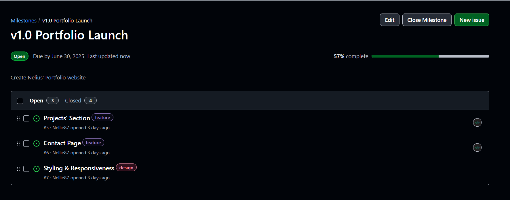
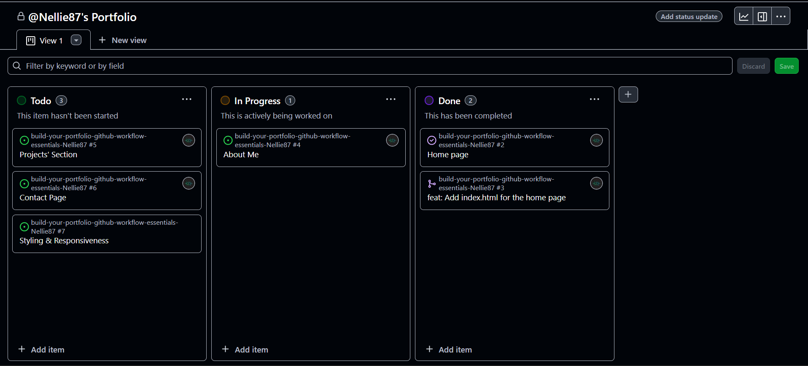
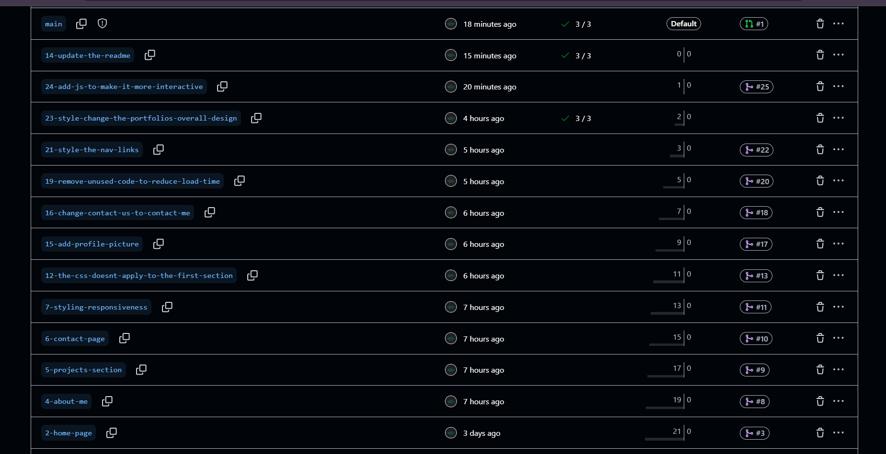
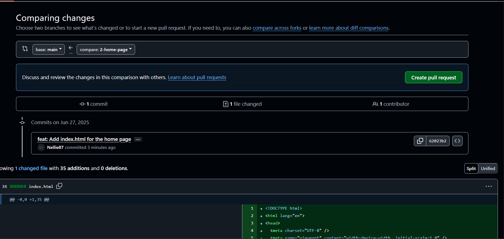
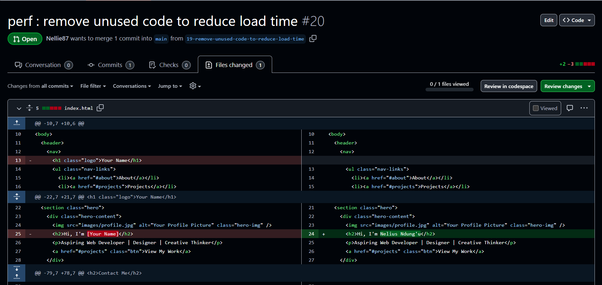

# Personal Portfolio Documentation

## 1. Student Details

- **Ndung'u Nelius Wambui**:
- **150873**:
- **Nellie87**:
- **nelliwndungu@gmail.com**:

## 2. Deployed Portfolio Link

- **GitHub Pages URL**:  
  _(https://is-project-4th-year.github.io/build-your-portfolio-github-workflow-essentials-Nellie87/)_

## 3. Learnings from the Git Crash Program

Write about **4 things** you expected to learn during the Git crash course (yes, we all came in with some big hopes 😅).
For each one, mention:

What you thought it would be like **(Expectation 👀)**

What you actually learned **(Reality 😅)**

And how it helped with your personal portfolio project 💻

make it honest—and if it surprised you, even better!

. Concept: GitHub as just “cloud storage”
Expectation 👀:
I thought GitHub was mainly a place to upload and store code online—basically like Google Drive for developers.

Reality 😅:
Turns out GitHub is more like a full-on project management tool. I learned how to create issues, milestones, and use pull requests to manage my progress and changes.

Impact 💡:
Using GitHub Issues and a Project Board helped me break down my portfolio tasks and track them. It kept me super organized and less overwhelmed.

2. Concept: Branching
Expectation 👀:
I assumed branching was only needed for teams or advanced-level developers working on complex systems.

Reality 😅:
Even in a solo project, branching saved me from ruining my main portfolio page. It allowed me to safely experiment with new sections before merging them in.

Impact 💡:
I used branches for my About, Projects, and Contact sections. Each one was developed, tested, and then pulled into main without breaking anything.

3. Concept: Commit Messages
Expectation 👀:
I thought you could just type “updated the index.html” and move on—it didn’t matter what the message said.

Reality 😅:
Clear and structured commit messages actually made it way easier to track changes and troubleshoot issues. Using types like feat, style, and fix made everything more readable.

Impact 💡:
I started using real commit messages like feat: add contact form and style(nav): fix spacing in header—which helped me stay focused and intentional with each change.

4. Concept: Merge Conflicts
Expectation 👀:
I figured I wouldn’t even run into merge conflicts since I was working alone.

Reality 😅:
I hit one when I forgot to pull the latest changes before pushing! It felt intimidating at first, but learning how to resolve it through VS Code made me more confident.

Impact 💡:
After resolving that one conflict, I made it a habit to always pull before pushing. It made me feel more in control of my workflow and less afraid of “breaking things.”


## 4. Screenshots of Key GitHub Features

Include screenshots that demonstrate how you used GitHub to manage your project. For each screenshot, write a short caption explaining what it shows.

> Upload the screenshots to your GitHub repository and reference them here using Markdown image syntax:
> (you could just simply copy and paste the image into the Assignment.md)

```markdown

```

### A. Milestones and Issues

- Screenshot showing your milestone(s) and the issues linked to it.



### B. Project Board

- Screenshot of your GitHub Project Board with issues organized into columns (e.g., To Do, In Progress, Done).


### C. Branching

- Screenshot showing your branch list with meaningful naming.



### D. Pull Requests

- Screenshot of a pull request that’s either open or merged and linked to a related issue.



### E. Merge Conflict Resolution

- Screenshot of a resolved merge conflict (in a pull request, commit history, or your local terminal/GitHub Desktop).

